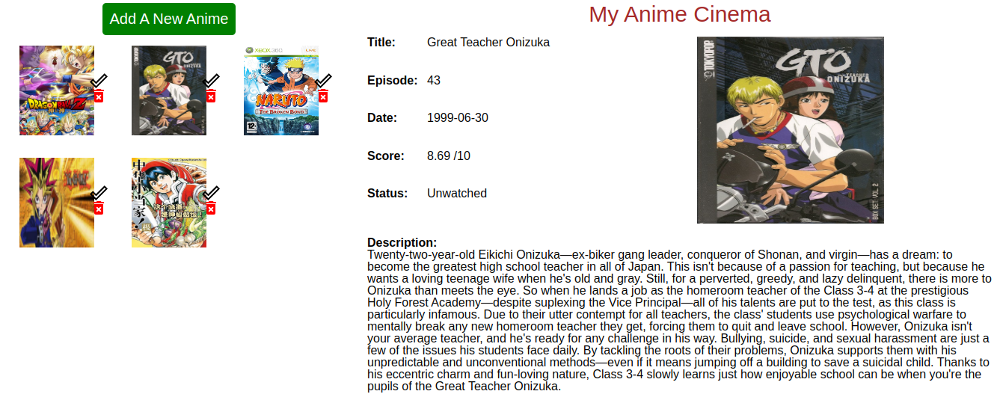
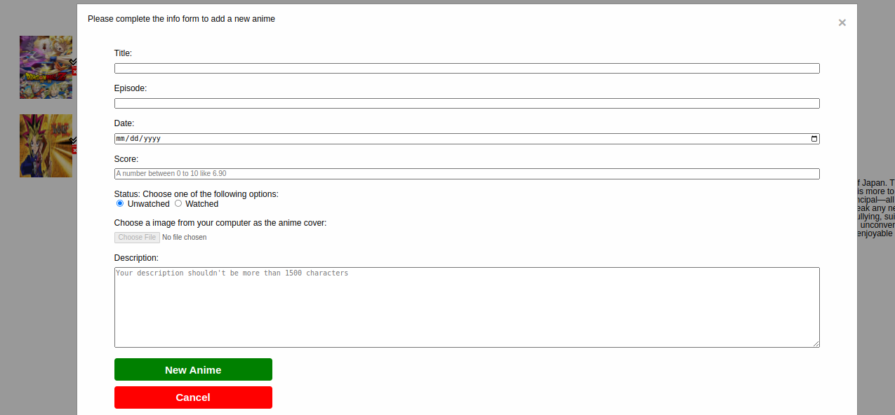

# odin_Library

[Live preview](https://maxim55069633.github.io/odin_Library/)

In this project, I practice how to write an object constructor and instantiate the object. (That is anime in my case). I am also aware of the importance of reasonable data stucture when I want to store or use data efficiently.

I successfully overcome the following obstables:
1. how to set a constraint on users' uploaded file? E.g. Only accept images.
2. how to get information from form in javascript?
3. How to create a modal box?

Screenshot:
1. 

2. 

Credit to the images from Bing under the filter of free to share and use commercially
naruto
https://cn.bing.com/images/search?view=detailV2&ccid=zNerWVOz&id=BC56443CC1E1D5DEF44A7465AC52F06BAB640C4D&thid=OIP.zNerWVOzkJt78CSUiEbY3AAAAA&mediaurl=https%3a%2f%2fcdn.wikimg.net%2fen%2fstrategywiki%2fimages%2f1%2f16%2fNaruto_The_Broken_Bond_cover.jpg&exph=520&expw=369&q=naruto&simid=608050095502215888&FORM=IRPRST&ck=7CA5B372464FE992DC1A73D5BD1BD80A&selectedIndex=329&qft=+filterui%3alicense-L2_L3_L4&ajaxhist=0&ajaxserp=0

onizuka:
https://cn.bing.com/images/search?view=detailV2&ccid=mCV8YlB9&id=067CAD59BA5695BF52C621034FE12BEF84DA81E5&thid=OIP.mCV8YlB9tpeu3Jc4fR5sWQHaKl&mediaurl=https%3a%2f%2fts1.cn.mm.bing.net%2fth%2fid%2fR-C.98257c62507db697aedc97387d1e6c59%3frik%3d5YHahO8r4U8DIQ%26riu%3dhttp%253a%252f%252fhouseofanime.org%252fphpdvdprofiler%252fimages%252f645573322250f.jpg%26ehk%3d9jpt%252bf0yZA1%252fvZ%252bIUqymZVKnrD9uzVpIYlyE4BI2vjs%253d%26risl%3d%26pid%3dImgRaw%26r%3d0&exph=700&expw=490&q=great+teacher+onizuka&simid=608014803758303271&FORM=IRPRST&ck=E2A301EABE5D5A256AE00E3CB3B3FEF3&selectedIndex=7&qft=+filterui%3alicense-L2_L3_L4&ajaxhist=0&ajaxserp=0

yugioh:
https://cn.bing.com/images/search?view=detailV2&ccid=PDZviDVS&id=37EBD00E8A91A4D156E6DD338C013B5E0A827758&thid=OIP.PDZviDVSQbfmgQLQh7sO_gHaD4&mediaurl=https%3a%2f%2fstatic.miraheze.org%2fbesttvshowswiki%2fthumb%2f7%2f70%2fYu-Gi-Oh_Duel_Monsters.jpg%2f495px-Yu-Gi-Oh_Duel_Monsters.jpg&exph=260&expw=495&q=yugioh&simid=608024493211797768&FORM=IRPRST&ck=EF30267E96ED55B01DC431DF2AEEABFF&selectedIndex=12&qft=+filterui%3alicense-L2_L3_L4&ajaxhist=0&ajaxserp=0

dragon ball:
https://cn.bing.com/images/search?view=detailV2&ccid=SJVL6TvE&id=D6765F150AF020B7533909C8E20ECA41BA2C622A&thid=OIP.SJVL6TvEAjHeAkSmIwj4wgHaLH&mediaurl=https%3a%2f%2fstatic.miraheze.org%2fgreatestmovieswiki%2fe%2fec%2fBeerus.jpg&exph=1440&expw=960&q=dragon+ball&simid=608027031534917176&FORM=IRPRST&ck=D1558682DE688DD49ADC424B9E18575D&selectedIndex=17&qft=+filterui%3alicense-L2_L3_L4&ajaxhist=0&ajaxserp=0

chuuka_ichiban
https://cn.bing.com/images/search?view=detailV2&ccid=tU5SD3H%2f&id=454A2949BC94EC75812EEDCA9250F07398EE5B5E&thid=OIP.tU5SD3H_EJZ6V8kLI_S0yQHaKX&mediaurl=https%3a%2f%2fwww.manhuadaohang.com%2fw%2fimages%2fthumb%2f1%2f17%2f%e4%b8%ad%e5%8d%8e%e5%b0%8f%e5%bd%93%e5%ae%b6%ef%bc%81%e6%9e%81.jpg%2f480px-%e4%b8%ad%e5%8d%8e%e5%b0%8f%e5%bd%93%e5%ae%b6%ef%bc%81%e6%9e%81.jpg&exph=672&expw=480&q=%e4%b8%ad%e5%8d%8e%e5%b0%8f%e5%bd%93%e5%ae%b6&simid=607996408430224453&FORM=IRPRST&ck=3D9884607B104B2E788BFE9A662E4FED&selectedIndex=1&qft=+filterui%3alicense-L2_L3_L4&ajaxhist=0&ajaxserp=0

placeholder
https://cn.bing.com/images/search?view=detailV2&ccid=bZFVh9PY&id=97C364FF9EDC83646B6C60425F1C7C088B1B05FA&thid=OIP.bZFVh9PYxKOXQKBIamgr6gAAAA&mediaurl=https%3a%2f%2fcdn.sstatic.net%2fimg%2fad-placeholder.png&exph=250&expw=220&q=placeholder+image&simid=608048622326449361&FORM=IRPRST&ck=0490A7E5127FBACE06905BA5D6CD7442&selectedIndex=16&qft=+filterui%3alicense-L2_L3_L4&ajaxhist=0&ajaxserp=0